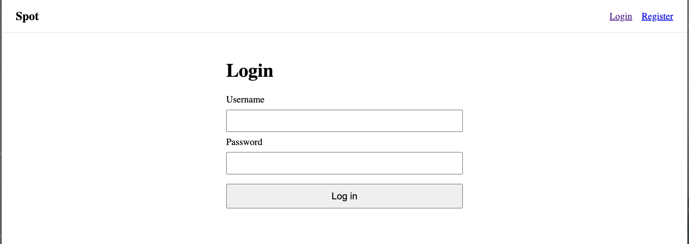
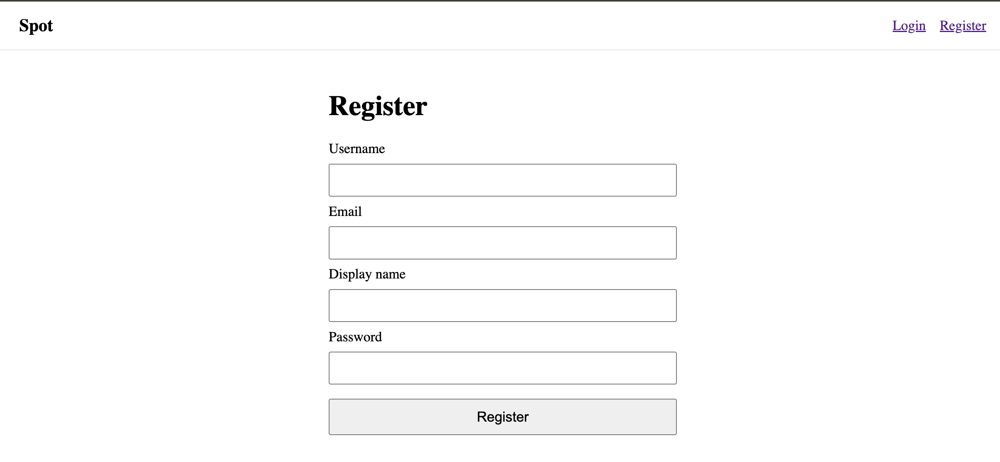
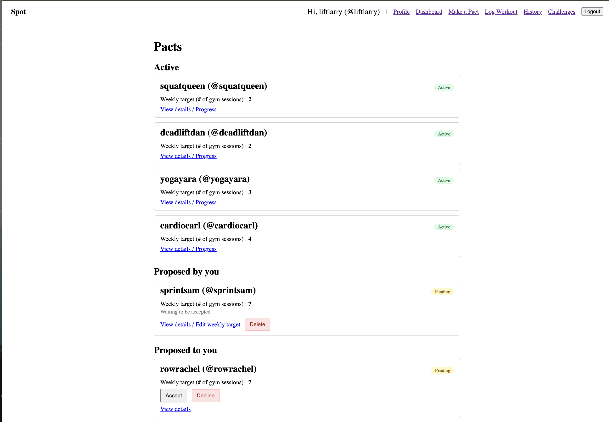
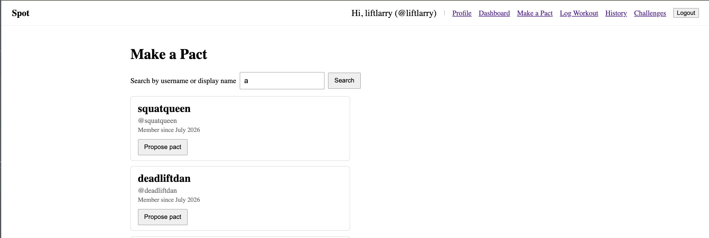
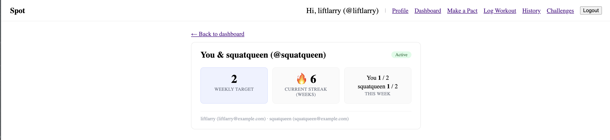
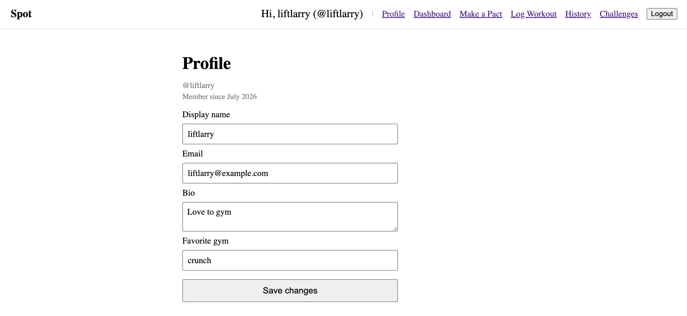
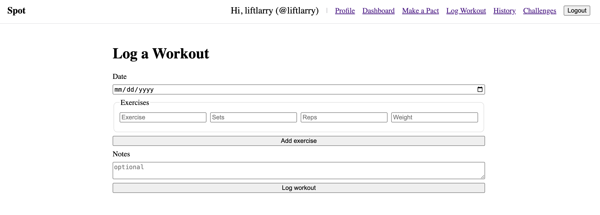
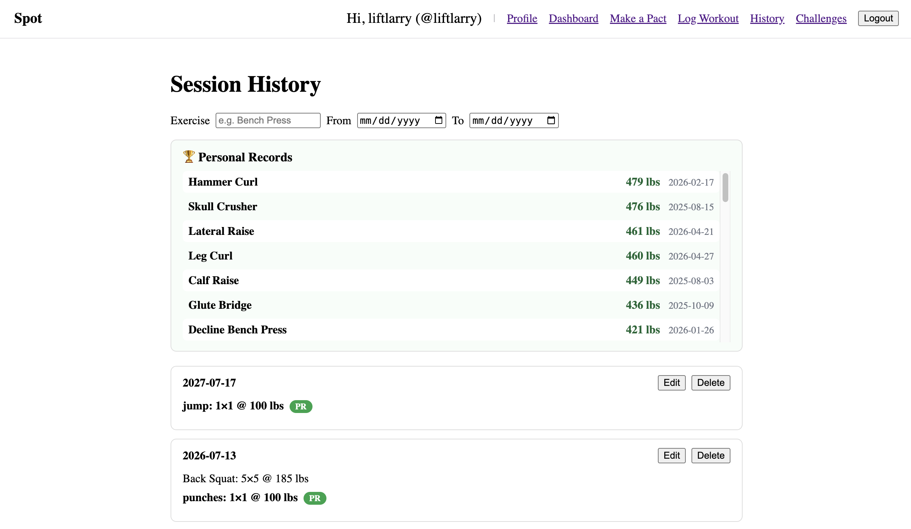
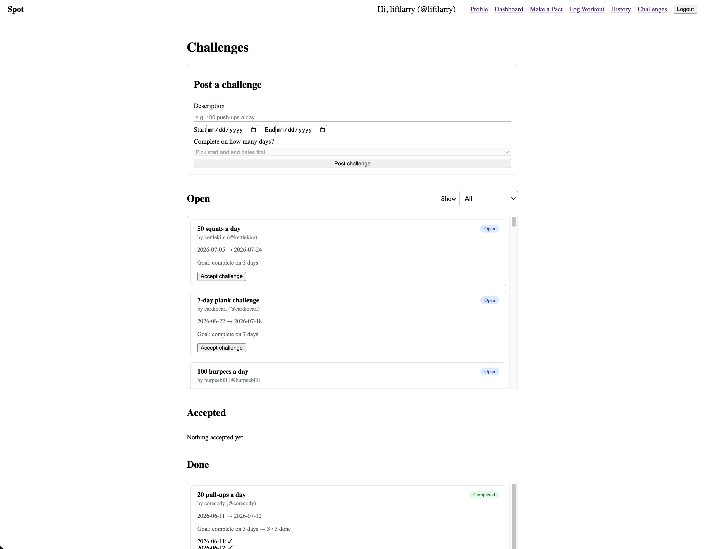

# Spot

A full-stack workout accountability app built with Node.js, Express, MongoDB
(native driver), and a React (Hooks) client-side-rendered frontend built with Vite.
Pair up with a partner, set a weekly workout target, and keep each other honest.

**Live Website:** _TODO: add Render URL after deploy_

**Demo Video:** _TODO: add video link_

---

## About

Spot is built for CS5610 Web Development at Northeastern University. Most people
don't quit the gym because they lack a plan - they quit because nobody notices
when they skip. Spot is built around accountability between friends. Users log
their workout sessions (exercises, sets, reps, weight) and the app automatically
flags new personal records (PRs). On top of the logs, users form **pacts** with a
partner — a shared weekly target like "we each train 3 times a week." Each week the
app checks both partners' logged sessions; the week only clears if both hit the
target, and cleared weeks build a shared streak that breaks for both if one person
slacks. Users can also post one-off **challenges** ("100 push-ups a day for 7 days")
that others accept and complete within a time window. It uses four MongoDB
collections (users, sessions, challenges, pacts), each with full CRUD, exposed
through a REST API and rendered entirely in the browser with React.

---

## Pages

- **Login / Register** (`/login`, `/register`): Create an account or sign in;
  authentication is session-based via Passport.
- **Dashboard** (`/`): Your pacts and their shared streaks, with a link to make a
  pact if you have none yet.
- **Make a Pact** (`/search`): Search users by username to start a pact.
- **Profile** (`/profile`): View and edit your profile, or delete your account.
- **Log Workout** (`/log`): Log a session with a date, one or more exercises
  (sets/reps/weight), and notes; new personal records are flagged on submit.
- **Session History** (`/history`): Browse past sessions with filters by exercise
  and date range, edit or delete records, and see PR-highlighted lifts.
- **Challenges** (`/challenges`): Post challenges, browse open ones, accept them,
  and log daily proof entries; challenges are grouped into Open / Accepted / Done.

---

## Key Features

**Sessions & PRs**

- Full CRUD — log, view, edit, and delete workout sessions
- Automatic personal-record detection: each logged lift is compared against the
  user's prior best for that exercise (via a MongoDB aggregation pipeline) and
  flagged if it's a new PR
- Session history with combinable filters (exercise name, date range) done
  client-side for instant feedback
- PR-highlighted display so progress is visible at a glance

**Challenges**

- Full CRUD — create, browse, and delete challenges
- Lifecycle: `open` -> `accepted` -> `completed` / `failed`
- Accept an open challenge and log daily proof entries during the window
- Fail-fast rule — a single missed day fails the challenge immediately
- Grouped into Open / Accepted / Done sections; Accepted and Done are scoped to
  the logged-in user

**Pacts & Streaks**

- Full CRUD on pacts — create with a partner and weekly target, view the pact
  dashboard, edit the target, dissolve the pact
- Weekly pact-clearing logic — counts each partner's sessions for the current week
  against the target and advances or resets the shared streak

**Accounts & Auth**

- Register / login / logout with Passport (local strategy), session-based
- Passwords hashed with bcrypt; password hashes never leave the API
- Partner search and profile management

---

## Tech Stack

- **Node.js + Express** — REST API (ES modules)
- **MongoDB (native Node.js driver)** — four collections (`users`, `sessions`,
  `challenges`, `pacts`), no Mongoose
- **React (Hooks) + React Router** — client-side rendering with the Fetch API,
  built with Vite
- **Passport + bcrypt** — session-based authentication
- **ESLint + Prettier** — code quality and formatting

---

## Install & Run

The app has two parts: a backend (`server/`) and a frontend (`frontend/`), each
with its own dependencies. It runs against a MongoDB Atlas cluster.

1. **Clone and install**

   ```bash
   git clone https://github.com/nipunjay10/Spot.git
   cd Spot

   # backend
   cd server
   npm install

   # frontend
   cd ../frontend
   npm install
   ```

2. **Set the connection string.** Create a `.env` file in `server/`:

   ```
   MONGO_URI=your-mongodb-atlas-connection-string
   PORT=3001
   SESSION_SECRET=any-random-string
   ```

   > `.env` is gitignored and never committed.

3. **Load the data.** A full snapshot of the database lives in `server/data/` —
   over 1,000 records across the collections. Import the per-collection JSON
   backups with `mongoimport`:

   ```bash
   mongoimport --uri "$MONGO_URI/spot" --collection users        --jsonArray --file server/data/json/users.json
   mongoimport --uri "$MONGO_URI/spot" --collection sessions     --jsonArray --file server/data/json/sessions.json
   mongoimport --uri "$MONGO_URI/spot" --collection challenges   --jsonArray --file server/data/json/challenges.json
   mongoimport --uri "$MONGO_URI/spot" --collection pacts        --jsonArray --file server/data/json/pacts.json
   mongoimport --uri "$MONGO_URI/spot" --collection acceptances  --jsonArray --file server/data/json/acceptances.json
   ```

   > For an exact copy (indexes and all) you can instead restore the binary dump:
   > `mongorestore --uri "$MONGO_URI" --nsInclude "spot.*" --drop server/data/dump`.
   > See `server/data/README.md` for details.

4. **Start both servers** (two terminals):

   ```bash
   # terminal 1 — backend (from server/)
   npm run dev

   # terminal 2 — frontend (from frontend/)
   npm run dev
   ```

5. Open the Vite dev URL (usually **[http://localhost:5173](http://localhost:5173)**).
   The frontend proxies `/api` requests to the backend on port 3001. Register an
   account and start logging workouts.

---

## Deployment (Render)

The Express server serves the built React app (`frontend/dist`) and the API from
one process, so Spot deploys as a **single Render Web Service** pointed at this
GitHub repo.

- **Build Command:**

  ```bash
  cd frontend && npm install && npm run build && cd ../server && npm install
  ```

- **Start Command:**

  ```bash
  cd server && npm start
  ```

- **Environment variables** (set in Render's dashboard, not committed):

  ```
  MONGO_URI=your-mongodb-atlas-connection-string
  SESSION_SECRET=a-long-random-string
  NODE_ENV=production
  ```

  > Don't set `PORT` — Render provides it automatically. `NODE_ENV=production`
  > turns on secure session cookies.

- **MongoDB Atlas:** under Network Access, allow connections from anywhere
  (`0.0.0.0/0`) so Render can reach the cluster.

---

## Screenshots

> _TODO: add one screenshot per page to the `images/` folder using the filenames
> below (they're already linked here, so the images render once added)._

### Login



### Register



### Dashboard (Pacts)



### Make a Pact (Partner Search)



### Pact Detail



### Profile



### Log Workout



### Session History



### Challenges



---

## Project Structure

```
Spot/
├── server/
│   ├── server.js               # Express entry point; mounts routes + serves the built frontend
│   ├── db/
│   │   ├── connection.js       # Single cached MongoDB connection
│   │   ├── usersDb.js          # Users collection access
│   │   ├── pactsDb.js          # Pacts collection access
│   │   ├── sessionCountsDb.js  # Weekly session counts (for streaks)
│   │   ├── challengesDb.js     # Challenges collection access
│   │   └── acceptancesDb.js    # Per-user challenge acceptances
│   ├── auth/
│   │   └── passport.js         # Passport local strategy + (de)serialize
│   ├── lib/
│   │   └── streak.js           # Week-math helpers + streak computation
│   ├── middleware/
│   │   ├── ensureAuthenticated.js
│   │   └── requireValidId.js   # Validates :id params as ObjectIds
│   ├── routes/
│   │   ├── auth.js             # /api/auth (register/login/logout/me)
│   │   ├── users.js            # /api/users (search + profile CRUD)
│   │   ├── pacts.js            # /api/pacts (CRUD + weekly streak logic)
│   │   ├── sessions.js         # /api/sessions (CRUD + PR detection)
│   │   └── challenges.js       # /api/challenges (CRUD + lifecycle)
│   └── data/                   # Full database snapshot (BSON dump + JSON backups)
├── frontend/
│   ├── vite.config.js
│   └── src/
│       ├── App.jsx             # Router + auth state
│       ├── components/         # NavBar, Layout, ProtectedRoute, cards, sections, forms
│       └── pages/              # Dashboard, Login, Register, Profile,
│                               # PartnerSearch, PactDetail, LogWorkout,
│                               # History, Challenges
├── README.md
├── LICENSE                     # MIT
└── package.json
```

---

## API

All endpoints return JSON. Session, challenge, pact, and streak routes require an
authenticated session; the logged-in user is read from the session (`req.user`),
not the request body.

### Auth — `/api/auth`

| Method | Path                 | Description                          |
| ------ | -------------------- | ------------------------------------ |
| `POST` | `/api/auth/register` | Register a new user and log them in. |
| `POST` | `/api/auth/login`    | Log in.                              |
| `POST` | `/api/auth/logout`   | Log out and end the session.         |
| `GET`  | `/api/auth/me`       | Get the currently logged-in user.    |

### Sessions — `/api/sessions`

| Method   | Path                | Description                                                                       |
| -------- | ------------------- | --------------------------------------------------------------------------------- |
| `GET`    | `/api/sessions`     | List the logged-in user's sessions (newest first).                                |
| `POST`   | `/api/sessions`     | Log a session; each exercise is flagged `isPR` if it beats the user's prior best. |
| `GET`    | `/api/sessions/:id` | Get one session by id.                                                            |
| `PUT`    | `/api/sessions/:id` | Update a session.                                                                 |
| `DELETE` | `/api/sessions/:id` | Delete a session.                                                                 |

### Challenges — `/api/challenges`

| Method   | Path                         | Description                                                                              |
| -------- | ---------------------------- | ---------------------------------------------------------------------------------------- |
| `GET`    | `/api/challenges`            | List challenges, each enriched with the creator and the logged-in user's own acceptance. |
| `POST`   | `/api/challenges`            | Create a challenge (creator = logged-in user).                                           |
| `PUT`    | `/api/challenges/:id/accept` | Accept an open challenge (creates the caller's acceptance).                              |
| `POST`   | `/api/challenges/:id/day`    | Toggle a day done on the caller's acceptance; completing the target resolves it.         |
| `DELETE` | `/api/challenges/:id`        | Delete a challenge (creator only, before anyone accepts).                                |

### Pacts — `/api/pacts`

| Method   | Path                    | Description                                                                                                |
| -------- | ----------------------- | ---------------------------------------------------------------------------------------------------------- |
| `GET`    | `/api/pacts`            | List the logged-in user's pacts, each with the partner, the current shared streak, and this week's counts. |
| `POST`   | `/api/pacts`            | Propose a pact to a partner with a weekly target.                                                          |
| `GET`    | `/api/pacts/:id`        | Get one pact.                                                                                              |
| `PUT`    | `/api/pacts/:id`        | Update a pact's weekly target.                                                                             |
| `PUT`    | `/api/pacts/:id/accept` | Accept a pact proposed to you (activates the pact).                                                        |
| `DELETE` | `/api/pacts/:id`        | Dissolve a pact.                                                                                           |

### Users — `/api/users`

| Method   | Path                       | Description                                                   |
| -------- | -------------------------- | ------------------------------------------------------------- |
| `GET`    | `/api/users?search=<term>` | Search users by username or display name (excludes yourself). |
| `GET`    | `/api/users/:id`           | Get one user's public profile.                                |
| `PUT`    | `/api/users/:id`           | Update your own profile.                                      |
| `DELETE` | `/api/users/:id`           | Delete your own account.                                      |

---

## Authors

**Nipun Jayakumar** — Sessions, PR detection, and Challenges
[GitHub](https://github.com/nipunjay10)

**Khush Patel** — Users, Authentication, and Pacts
[GitHub](https://github.com/kmpat339)

---

## Academic Reference

This project was created as part of the **Web Development Course (Summer 2026)** at
Northeastern University.

- **Course**: [CS5610 Web Development — Northeastern University](https://johnguerra.co/classes/webDevelopment_online_summer_2026/)
- **Instructor**: John Alexis Guerra Gómez

---

## Project Submissions

- **Design document:** _TODO: link the design doc_
- **Slide deck:** _TODO: link the slides_
- **Video presentation:** _TODO: link the demo video_
- **Thumbnail image:** _TODO: add thumbnail_

---

## Use of GenAI Tools

This section discloses where generative AI was used in this project. We used the
Claude Opus 4.8 model.

1. **Seed data generation.** Sample data for the sessions and challenges collections
   was generated with [Mockaroo](https://www.mockaroo.com/). Claude was used to help write
   the Node loader scripts that shaped the flat Mockaroo rows into the nested document
   structure the app expects (wrapping session exercise fields into an `exercises`
   array, converting id strings to native MongoDB `ObjectId`s, and setting
   `accepterId` to `null` for unaccepted challenges). The final database now ships as
   a snapshot in `server/data/` (see that folder's README).

2. **Scaffolding and debugging.** Claude was used as a coding aid to scaffold the
   sessions and challenges routes, the PR-detection aggregation pipeline, the
   challenge lifecycle logic, the pact-clearing streak logic, and the React frontend
   pages, and to help debug along the way. All decisions, validation rules, API
   design, and final code were reviewed and understood by the team.

3. **Build guidance.** Claude was used throughout the project to talk through
   Express / MongoDB / React concepts and review approach. All implementation
   choices were made and verified by the team.

---

## Contributing

This is a course project submission. External contributions are not accepted.

---

## License

This project is licensed under the MIT License. See [LICENSE](LICENSE) for details.
